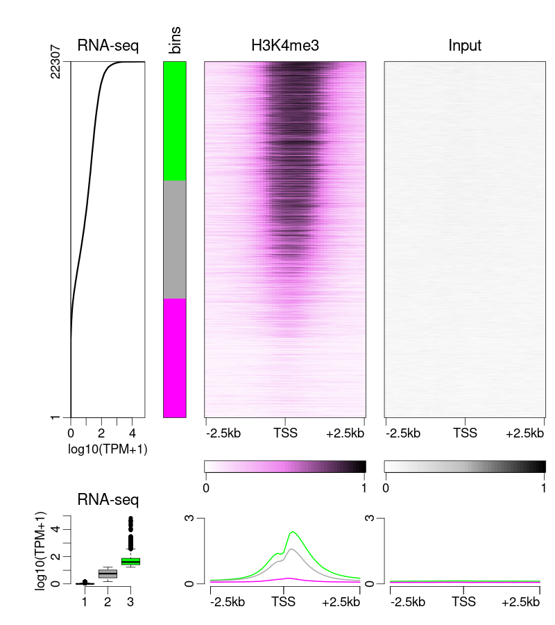

```{r setup, include = FALSE}
knitr::opts_chunk$set(
  collapse = TRUE,
  comment = "#>",
  cache = FALSE,
  fig.width = 4, fig.height = 5, fig.show = "hold",
  global.par = FALSE
)
```

# Introduction



The `epistack` package main objective is the visualizations of stacks 
of genomic tracks (such as, but not restricted to, ChIP-seq or
DNA methyation data)
centered at genomic regions of interest. `epistack` needs three 
different inputs:

- a genomic score objects, such as ChIP-seq coverage or DNA methylation values, 
provided as a `GRanges` (easily obtained from `bigwig` or `bam` files)
- a list of feature of interest, such as peaks or transcription start sites,
provided as a `GRanges` (easily obtained from `gtf` or `bed` files)
- a score to sort the features, such as peak height, or gene expression value

Each inputs are then combined in a single `GRanges` object use by epistack's
ploting functions.

After introducing epistack's plotting capacity, 
this document will present two use cases:

- plotting ChIP-seq signal at peaks, to investigate peak quality
- plotting DNA methylation and ChIP-seq signals at gene promoters 
sorted according to gene expression,
to investigate the associations between an epigenetic mark and gene expression

# Epistack visualisation

Epistack is a visualisation package. It uses a `GRanges` object as input, with
matrices embeded as metadata columns (`mcols()`). We will discuss how to
build such input obects in the next section. For now on, we will focus on
the visualisation functions using the example dataset included in the package.

The dataset can be accessed with:
```{r epidata, message=FALSE}
library(GenomicRanges)
library(epistack)

data("stackepi")
dim(mcols(stackepi))
stackepi[, 1:6]
```
## The `plotEpisatck()` function

This dataset can be visualised with the `plotEpistack()` function.
The first parameter is the input `GRanges` object.

The second parameter, `patterns` specifies which columns of `mcols(gr)` 
should be displayed as heatmap(s). The `patterns` values are prefixes or
regular expression that should match a set of column names. In the `stackepi`
dataset, only one track is present, with columns names starting with `window`.
Note that it is possible to have several different tracks embeded in the 
same `GRanges` object, as demonstarted in the next sections.

An aditional `metric_col` is used, to display score associated with each 
anchor region, such as expression values or peak scores. Optionaly, 
the `metric_col` can be transformed before ploting using the 
`metric_transfunc` parameters.

```{r epistack1}
plotEpistack(
  stackepi,
  pattern = "^window_", metric_col = "exp",
  ylim = c(0, 1), zlim = c(0, 1),
  x_labels = c("-2.5kb", "TSS", "+2.5kb"),
  titles = "DNA methylation", legends = "%mCpG",
  metric_title = "Expression", metric_label = "log10(TPM+1)",
  metric_transfunc = function(x) log10(x+1)
)
```

If a `bin` column is present, it is used to generate one average profile per bin.

```{r bining}
stackepi <- addBins(stackepi, nbins = 5)

plotEpistack(
  stackepi,
  pattern = "^window_", metric_col = "exp",
  ylim = c(0, 1), zlim = c(0, 1),
  x_labels = c("-2.5kb", "TSS", "+2.5kb"),
  titles = "DNA methylation", legends = "%mCpG",
  metric_title = "Expression", metric_label = "log10(TPM+1)",
  metric_transfunc = function(x) log10(x+1)
)
```


Colours can be changed using dedicated parameters:
```{r colours}
plotEpistack(
  stackepi,
  pattern = "^window_", metric_col = "exp",
  ylim = c(0, 1), zlim = c(0, 1),
  x_labels = c("-2.5kb", "TSS", "+2.5kb"),
  titles = "DNA methylation", legends = "%mCpG",
  metric_title = "Expression", metric_label = "log10(TPM+1)",
  metric_transfunc = function(x) log10(x+1),
  tints = "dodgerblue",
  bin_palette = rainbow
)
```
Text size, and other graphical parameters, can be changed using `cex` inside of
`plotEpistack()`. Indeed, additional arguments will be passed internaly to 
`par()` (see `?par` for more details).

```{r par, collapse=TRUE}
plotEpistack(
  stackepi,
  pattern = "^window_", metric_col = "exp",
  ylim = c(0, 1), zlim = c(0, 1),
  x_labels = c("-2.5kb", "TSS", "+2.5kb"),
  titles = "DNA methylation", legends = "%mCpG",
  metric_title = "Expression", metric_label = "log10(TPM+1)",
  metric_transfunc = function(x) log10(x+1),
  cex = 0.4, cex.main = 0.6
)

```

## Custom panel arrangements

Each panel can be plotted individually using dedicated functions. 
For example:
```{r plotAvgerageProfile, fig.small = TRUE}
plotAverageProfile(
  stackepi,
  ylim = c(0, 1),
  pattern = "^window_",
  x_labels = c("-2.5kb", "TSS", "+2.5kb"),
)

```

And:

```{r plotStackProfile, fig.small = TRUE}
plotStackProfile(
  stackepi,
  pattern = "^window_",
  x_labels = c("-2.5kb", "TSS", "+2.5kb"),
  palette = viridisLite::viridis,
  zlim = c(0, 1)
)
```

It is therefore possible to arrange panels as you whish, using the
multipanel framework of your choice (layout, grid, patchwork, etc.).

```{r customPanels, }
layout(matrix(1:3, ncol = 1), heights = c(1.5, 3, 0.5))
old_par <- par(mar = c(2.5, 4, 0.6, 0.6))

plotAverageProfile(
  stackepi, pattern = "^window_",
  x_labels = c("-2.5kb", "TSS", "+2.5kb"), ylim = c(0, 1),
)

plotStackProfile(
  stackepi, pattern = "^window_",
  x_labels = c("-2.5kb", "TSS", "+2.5kb"), zlim = c(0, 1),
  palette = viridisLite::viridis
)

plotStackProfileLegend(
  zlim = c(0, 1),
  palette = viridisLite::viridis
)

par(old_par)
layout(1)

```


# Example 1: ChIP-seq coverage at peaks

## data origin
In this part, we will use example ChIP-seq data
from the 
[2016 CASME course](https://www.bioconductor.org/help/course-materials/2016/CSAMA/lab-5-chipseq/Epigenetics.html)
"Basics of ChIP-seq data analysis" 
by Aleksandra Pekowska and Simon Anders.
Data can be found in this github repository: 
[https://github.com/Bioconductor/CSAMA2016/tree/master/lab-5-chipseq/EpigeneticsCSAMA/inst/bedfiles](github.com/Bioconductor/CSAMA2016/tree/master/lab-5-chipseq/EpigeneticsCSAMA/inst/bedfiles)

There is no need to download the data as it can be remotely parsed.
The data consists of two H3K27ac ChIP-seq replicates, an input control,
and one list of peak for each replicates. It has been generated in 
mouse Embryonic Stem cells and been subseted to have only data from chromosome 6
to allow fast vignette generation (but `epistack` can deal with whole genome 
ChIP-seq data!).

```{r examplepath}
path_reads <- c(
    read1 = "https://raw.githubusercontent.com/Bioconductor/CSAMA2016/master/lab-5-chipseq/EpigeneticsCSAMA/inst/bedfiles/H3K27ac_rep1_filtered_ucsc_chr6.bed",
    read2 = "https://raw.githubusercontent.com/Bioconductor/CSAMA2016/master/lab-5-chipseq/EpigeneticsCSAMA/inst/bedfiles/H3K27ac_rep2_filtered_ucsc_chr6.bed",
    input = "https://raw.githubusercontent.com/Bioconductor/CSAMA2016/master/lab-5-chipseq/EpigeneticsCSAMA/inst/bedfiles/ES_input_filtered_ucsc_chr6.bed"
)

path_peaks <- c(
    peak1 = "https://raw.githubusercontent.com/Bioconductor/CSAMA2016/master/lab-5-chipseq/EpigeneticsCSAMA/inst/bedfiles/Rep1_peaks_ucsc_chr6.bed",
    peak2 = "https://raw.githubusercontent.com/Bioconductor/CSAMA2016/master/lab-5-chipseq/EpigeneticsCSAMA/inst/bedfiles/Rep2_peaks_ucsc_chr6.bed"
)
```

## data loading

We first read the peaks using `r Biocpkg("rtracklayer")`:
```{r peak_loading, message=FALSE}
library(rtracklayer)
peaks <- lapply(path_peaks, import)
```

Peaks from each replicates can be merged using `r Biocpkg("GenomicRanges")`
`union()` function (loaded with `r Biocpkg("rtracklayer")`). 
We then rescue peaks metadata, and compute a new `mean_score` that we use 
to arrange our peak list.

```{r peak_merge, message=FALSE}
merged_peaks <- GenomicRanges::union(peaks[[1]], peaks[[2]])
```

```{r peak_merge2, message=FALSE}
scores_rep1 <- double(length(merged_peaks))
scores_rep1[findOverlaps(peaks[[1]], merged_peaks, select = "first")] <- peaks[[1]]$score

scores_rep2 <- double(length(merged_peaks))
scores_rep2[findOverlaps(peaks[[2]], merged_peaks, select = "first")] <- peaks[[2]]$score
```

```{r peak_merge3, message=FALSE}
peak_type <- ifelse(
    scores_rep1 != 0 & scores_rep2 != 0, "Both", ifelse(
        scores_rep1 != 0, "Rep1 only", "Rep2 only"
    )
)

mcols(merged_peaks) <- DataFrame(scores_rep1, scores_rep2, peak_type)
merged_peaks$mean_scores <- apply((mcols(merged_peaks)[, c("scores_rep1", "scores_rep2")]), 1, mean)
merged_peaks <- merged_peaks[order(merged_peaks$mean_scores, decreasing = TRUE), ]
rm(scores_rep1, scores_rep2, peak_type)

merged_peaks
```

We then import the ChIP-seq reads. In the example datasets,
they are provided as .bed files, but for ChIP-seq we recommand
importing .bigwig coverage files. Bam files can also be imported using 
`GenomicAlignments::readGAlignment*()`.

```{r read_loading}
reads <- lapply(path_reads, import)
```

## Generating coverage matrices

We generate coverage matrices with ChIP-seq coverage signal
summarized around each ChIP-seq peaks.
Several tools exists to generate such coverage matrices. We will demonstrate the
`normalizeToMatrix()` method from `r Biocpkg("EnrichedHeatmap")`.
Other alternatives include `r Biocpkg("Repitools")`' `featureScores()`,
or `r Biocpkg("seqplots")`' `getPlotSetArray()`.

We will focus on the regions around peak centers, extended from +/-5kb with
a window size of 250 bp. We keep track of the extent of our region of interest
in a `xlab` variable, and specify unique column names for each matrix.

Note: when using ChIP-seq data from a bigwig file, use the `value_column` parameter
of the `normalizeToMatrix()` function.

```{r coverage_matrices, message=FALSE}
summary(width(merged_peaks))

library(EnrichedHeatmap)

coverage_matrices <- lapply(
    reads,
    function(x) {
        normalizeToMatrix(
            x,
            resize(merged_peaks, width = 1, fix = "center"),
            extend = 5000, w = 250, 
            mean_mode = "coverage"
        )
    }
)

colnames(coverage_matrices[[1]]) <- paste("Rep1" , seq_len(ncol(coverage_matrices[[1]])), sep = "_")
colnames(coverage_matrices[[2]]) <- paste("Rep2" , seq_len(ncol(coverage_matrices[[2]])), sep = "_")
colnames(coverage_matrices[[3]]) <- paste("Input", seq_len(ncol(coverage_matrices[[3]])), sep = "_")

xlabs <- c("-5kb", "peak center", "+5kb")
```

We then add each matrix to the `merged_peaks` object.

```{r ready_to_plot}
mcols(merged_peaks) <- cbind(
    mcols(merged_peaks), 
    coverage_matrices[[1]], 
    coverage_matrices[[2]],
    coverage_matrices[[3]]
)
```

## Plotting

```{r setup2, include = FALSE}
knitr::opts_chunk$set(
  fig.width=6, fig.height=5
)
```

The `plotEpistack()` function will use the `merged_peaks` object to generate a
complex representation of the ChIP-seq signals around
the genomic feature of interests (here ChIP-seq peaks).

```{r peak_plot}
library(epistack)

plotEpistack(
    merged_peaks,
    patterns = c("^Rep1_", "^Rep2_", "^Input_"),
    tints = c("dodgerblue", "firebrick1", "grey"), 
    titles = c("Rep1", "Rep2" , "Input"),
    x_labels = xlabs,
    zlim = c(0, 4), ylim = c(0, 4), 
    metric_col = "mean_scores", metric_title = "Peak score",
    metric_label = "log10(score)",
    metric_transfunc = function(x) log10(x)
)
```

If a `bin` column is present in the input `GRanges` object, it will 
be used to annotate the figure and to generate one average profile per bin
in the lower panels. Here we use the `peak_type` as our bin column.

```{r peak_plot_bin}

merged_peaks$bin <- merged_peaks$peak_type

plotEpistack(
    merged_peaks,
    patterns = c("^Rep1_", "^Rep2_", "^Input_"),
    tints = c("dodgerblue", "firebrick1", "grey"), 
    titles = c("Rep1", "Rep2" , "Input"),
    x_labels = xlabs,
    zlim = c(0, 4), ylim = c(0, 4), 
    metric_col = "mean_scores", metric_title = "Peak score", metric_label = "log10(score)",
    metric_transfunc = function(x) log10(x),
    bin_palette = colorRampPalette(c("darkorchid1", "dodgerblue", "firebrick1")),
    npix_height = 300
)

```

We can also sort on the bins first, and then on peak score. Epistack will 
respect the order in the `GRanges` object.
```{r peak_plot_bin2}
merged_peaks <- merged_peaks[order(
  merged_peaks$bin, merged_peaks$mean_scores,
  decreasing = c(FALSE, TRUE), method = "radix"
), ]

plotEpistack(
    merged_peaks,
    patterns = c("^Rep1_", "^Rep2_", "^Input_"),
    tints = c("dodgerblue", "firebrick1", "grey"), 
    titles = c("Rep1", "Rep2" , "Input"),
    x_labels = xlabs,
    zlim = c(0, 4), ylim = c(0, 4), 
    metric_col = "mean_scores", metric_title = "Peak score", metric_label = "log10(score)",
    metric_transfunc = function(x) log10(x),
    bin_palette = colorRampPalette(c("darkorchid1", "dodgerblue", "firebrick1")),
    npix_height = 300
)

```

# Example 2: DNA methylation levels and ChIP-seq coverage at gene promoters sorted according to expression levels

## Obtaining the TSS coordinates

In this part, we will plot the epigenetic signals at gene promoters, or more
precisely around gene Transcription Start Sites (TSS).
TSS coordinates can be obtained from various sources. One can access
the [Ensembl](https://www.ensembl.org/index.html) annotations using 
`r Biocpkg("biomaRt")`, download a `.gtf` file and parse it using `r Biocpkg("rtracklayer")`'s `import()`, or use `r Biocpkg("AnnotationHub")` and 
`r Biocpkg("ensembldb")`. It is however important to work with the same genome
version has the one used to align the ChIP-seq reads.

For simplicity, we will use `r Biocpkg("EnrichedHeatmap")` example data.

```{r example2_tss}
load(
    system.file("extdata", "chr21_test_data.RData",
                package = "EnrichedHeatmap"),
    verbose = TRUE
)

tss <- promoters(genes, upstream = 0, downstream = 1)
tss$gene_id <- names(tss)

tss
```

## Adding expression data to the TSS coordinates

Epistack can work with any units and any scores, not limited to
expression data. Here we will use gene expression data from an RNA-seq 
experiment, in RPKM units, as it is the data format available in 
`r Biocpkg("EnrichedHeatmap")` example dataset.
To join the expression data to the TSS coordinates, we will use an 
`r Biocpkg("epistack")` utility function `addMetricAndArrangeGRanges()`:

```{r expression_data}
expr <- data.frame(
    gene_id = names(rpkm),
    expr = rpkm
)

epidata <- addMetricAndArrangeGRanges(
    tss, expr,
    gr_key = "gene_id",
    order_key = "gene_id", order_value = "expr"
)

epidata
```

We create 5 bins of genes of equal sizes depending on the expression levels,
with `r Biocpkg("epistack")` utility function `addBins()`:

```{r adding_bins}
epidata <- addBins(epidata, nbins = 5)
epidata
```

## Extracting the epigenetic signals

As previously described, we use `r Biocpkg("EnrichedHeatmap")`'s 
`normalizeToMatrix()` function to extract the signals, rename the signal
colmun names, and add them to the epidata GRanges object:

```{r signal_extraction}
methstack <- normalizeToMatrix(
    meth, epidata, value_column = "meth",
    extend = 5000, w = 250, mean_mode = "absolute"
)
colnames(methstack) <- paste("meth" , seq_len(ncol(methstack)), sep = "_")

h3k4me3stack <- normalizeToMatrix(
    H3K4me3, epidata, value_column = "coverage",
    extend = 5000, w = 250, mean_mode = "coverage"
)
colnames(h3k4me3stack) <- paste("H3K4me3", seq_len(ncol(h3k4me3stack)), sep = "_")

mcols(epidata) <- cbind(
    mcols(epidata), methstack, h3k4me3stack
)
```

## Epistack plotting

The `epidata` GRanges object is now ready to plot:

```{r example2_plotting}
plotEpistack(
    epidata,
    patterns = c("^meth_", "^H3K4me3"),
    tints = c("tomato", "springgreen"),
    titles = c("DNA methylation", "H3K4me3"),
    zlim = list(c(0, 1), c(0, 25)), ylim = list(c(0, 1), c(0, 50)),
    x_labels = c("-5kb", "TSS", "+5kb"),
    metric_col = "expr", metric_title = "Gene expression",
    metric_label = "log10(RPKM + 1)",
    metric_transfunc = function(x) log10(x + 1),
    npix_height = 300
)
```

